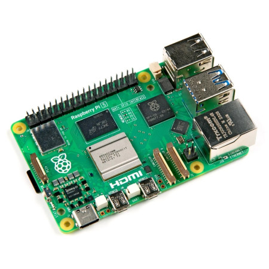

# Sistema de Detección de Tráfico (Edge-AI)

> En este repositorio se desarrolla un sistema de tráfico completo,su función principal es la detección de personas, transito vehicular y animales.


##  Desarrolladores
El sistema fue desarrollado por:

- Nagel Eduardo Mejía Segura
- Oscar Gonzalez Cambronero
- Wilberth Gutierrez Montero

## Caracteristicas del Computador *Host* Utilizado para construir imagenes

- **Fabricante**: Acer
- **Modelo**: Aspire A515-55
- **Sistema Operativo y Arquitectura**: Pop!_OS 22.04 LTS x86_64
- **CPU y Nucleos**: Intel i7-1065G7 (8) @ 3.900GHz
- **Capacidad RAM**: 8 GB
- **Almacenamiento**: 512 GB

## Caracteristicas del Procesador *Local*

- **Fabricante**: Raspberry Pi
- **Modelo**: Raspberry Pi 5
- **CPU y Nucleos**: Cortex-A76 64-bits quad-core
- **Capacidad RAM**: 8 GB
- **Almacenamiento**: 64 GB

<p align="center">

</p>

## Caracteristicas de la *Cámara*

- **Fabricante**: Logitech
- **Modelo**: Logitech C170 V-U0026
- **Conectividad** : USB 2.0
- **Resolución**: 640x480 pixeles

<p align="center">

</p>

## Herramientas de Desarrollo y Requisitos

### Yocto Project
Herramienta para customizar y generar imagenes de Linux.

**Requiere**:
  - 90 GB de disco duro libre minimo
  - 32 GB de RAM (Mejor perfomance en construcción)
  - Distribución de Linux
  - Dependencias:
      - Git 1.8.3.1
      - tar 1.28
      - Python 3.9.0
      - gcc 10.1
      - GNU make 4.0


### OpenCV
Herramienta para visión por computadora, permite procesar imagenes.

### Tensorflow Lite
Herramienta open-source de aprendizaje automatico, para ejecutar modelos ligeros en dispositivos mobiles o embebidos.

## Estructura básica del proyecto

```
├──meta-mytraffic-app/
│   ├── conf
│   │   └── layer.conf
│   └── recipes-app
│        └── traffic-detection
│            ├── files
│            │   ├── modelos
│            │   │   ├── detect.tflite
│            │   │   └── labelmap.txt
│            │   ├── traffic_detection.py
│            │   └── videos
│            │       ├── low_traffic.mp4
│            │       └── medium_traffic2.mp4
│            └── traffic-detection_1.0.bb
└── build
    └── conf/
        ├── bblayers.conf
        └── local.conf

```

## Generación de Imagen Custom

Si el sistema host cumple con los requisitos se puede empezar por instalar los siguientes paquetes

> [!NOTE]
> Para el ejemplo se está tomando una distribución basada en Ubuntu

```bash
sudo apt-get install build-essential chrpath cpio debianutils diffstat file gawk gcc git iputils-ping libacl1 liblz4-tool locales python3 python3-git python3-jinja2 python3-pexpect python3-pip python3-subunit socat texinfo unzip wget xz-utils zstd
```

Seguidamente se puede clonar el repositorio, notese que se pasa directamente a un branch, exactamente el de `my-new-rpi` que es donde se encuentra el desarrollo de la aplicación:

```bash
git clone -b my-new-rpi git@github.com:NagelMS/poky-edge-ai.git
```

Si bien el repositorio está hecho para poder generar la imagen immediatamente se pueden observar algunos detalles primarios. 

En el directorio `meta-mytraffic-app` se encuentran la estructura de la aplicación, donde hay un directorio `recipes-app/traffic-detection/files` donde se encuentran los scripts de python de los programas. Tambien se encuentra la receta `traffic-detection_1.0.bb` que contiene lo siguiente

```bash
SUMMARY = "Aplicación para detección de transito usando TensorFlow Lite"
DESCRIPTION = "Aplicación de python para detección de trafico usando vision por computador y TensorFlowLite"
LICENSE = "MIT"
LIC_FILES_CHKSUM = "file://${COMMON_LICENSE_DIR}/MIT;md5=0835ade698e0bcf8506ecda2f7b4f302"

SRC_URI = " \
    file://traffic_detection.py \
    file://modelos/ \
    file://videos/ \
"

S = "${WORKDIR}"

RDEPENDS:${PN} = " \
    python3 \
    python3-core \
    python3-numpy \
    python3-opencv \
    python3-typing-extensions \
"

# Directorio de instalación
INSTALL_DIR = "/opt/traffic-detection"

do_install() {
    # Crear directorios
    install -d ${D}${INSTALL_DIR}
    install -d ${D}${INSTALL_DIR}/modelos
    install -d ${D}${INSTALL_DIR}/videos
    
    # Instalar script principal
    install -m 0755 ${WORKDIR}/traffic_detection.py ${D}${INSTALL_DIR}/
    
    # Instalar archivos del modelo
    if [ -d ${WORKDIR}/modelo ]; then
        cp -r ${WORKDIR}/modelo/* ${D}${INSTALL_DIR}/modelos/
    fi
    
    # Instalar videos de prueba
    if [ -d ${WORKDIR}/videos ]; then
        cp -r ${WORKDIR}/videos/* ${D}${INSTALL_DIR}/videos/
    fi
    
    # Crear script de lanzamiento en /usr/bin
    install -d ${D}${bindir}
    cat > ${D}${bindir}/traffic-detection << 'EOF'
#!/bin/sh
cd /opt/traffic-detection
python3 traffic_detection.py "$@"
EOF
    chmod 0755 ${D}${bindir}/traffic-detection
}

FILES:${PN} += " \
    ${INSTALL_DIR} \
    ${INSTALL_DIR}/* \
    ${bindir}/traffic-detection \
"

```

En el directorio de configuraciones de la construcción `build/conf/` hay dos archivos importantes el `bblayers.conf` el cual ya contiene las layers necesarias para que el sistema funcione.

```bash
# POKY_BBLAYERS_CONF_VERSION is increased each time build/conf/bblayers.conf
# changes incompatibly
POKY_BBLAYERS_CONF_VERSION = "2"

BBPATH = "${TOPDIR}"
BBFILES ?= ""

BBLAYERS ?= " \
  ${TOPDIR}/../meta \
  ${TOPDIR}/../meta-poky \
  ${TOPDIR}/../meta-yocto-bsp \
  ${TOPDIR}/../meta-raspberrypi \
  ${TOPDIR}/../meta-openembedded/meta-oe \
  ${TOPDIR}/../meta-openembedded/meta-python \
  ${TOPDIR}/../meta-openembedded/meta-multimedia \
  ${TOPDIR}/../meta-tensorflow \
  ${TOPDIR}/../meta-mytraffic-app \
  "

```

Las principales capas añadidas son las siguientes:

- `meta-python`: Capa para recetas relacionada al interprete de Python
- `meta-multimedia`: Capa con recetas para procesamiento multimedia.
- `meta-raspberrypi`: Capa para generar la maquina para el RaspberryPi 5
- `meta-mytraffic-app`: Capa donde se encuentra la aplicación desarrollada

---

El otro archivo principal es el **`local.conf`**, entre los primeros aspectos importantes se encuentra la target machine seleccionada:

```bash
MACHINE ?= "raspberrypi5"
```

En la parte inferior del archivo, se tienen la mayoría de configuraciones importantes:

```bash
CONF_VERSION = "2"


# SSTATE: enable upstream hash server and mirrors for faster incremental builds
BB_HASHSERVE_UPSTREAM = "wss://hashserv.yoctoproject.org/ws"
SSTATE_MIRRORS ?= "file://.* http://sstate.yoctoproject.org/all/PATH;downloadfilename=PATH"
BB_HASHSERVE = "auto"
BB_SIGNATURE_HANDLER = "OEEquivHash"


BB_NUMBER_THREADS ?= "8"
PARALLEL_MAKE ?= "-j 8"

# systemd
DISTRO_FEATURES:remove = "sysvinit"
DISTRO_FEATURES:append = " systemd ssh usrmerge"
VIRTUAL-RUNTIME_init_manager = "systemd"
VIRTUAL-RUNTIME_initscripts = ""
SYSTEMD_AUTO_ENABLE = "enable"

EXTRA_IMAGE_FEATURES += "ssh-server-openssh debug-tweaks package-management"
LICENSE_FLAGS_ACCEPTED = "commercial"


# Paquetes
IMAGE_INSTALL:append = " \
  openssh \
  sudo \
  python3 \
  python3-numpy \
  python3-requests \
  python3-opencv \
  python3-pillow \
  tensorflow-lite \
  opencv \
  kernel-module-uvcvideo \
  v4l-utils \
  gstreamer1.0 \
  gstreamer1.0-plugins-base \
  gstreamer1.0-plugins-good \
  gstreamer1.0-plugins-bad \
  gstreamer1.0-plugins-ugly \
  gstreamer1.0-libav \
  gstreamer1.0-plugins-good-video4linux2 \
  xauth \
"

IMAGE_INSTALL:append = " traffic-detection"

```

### Proceso de Sintesis de Imagen

Habiendo observado lo importante, se puede iniciar a levantar el ambiente para la construcción, en e directorio general de repositorio se va a utilizar el siguiente comando.

```
source oe-init-build-env 
```

Automaticamente se posiciona en el directorio de build, seguidamente se pueden observar los layers disponibles, por medio de:

```
bitbake-layers show-layers
```

Se debería observar lo siguiente:

```
layer                 path                                      priority
==========================================================================
meta                  /home/nagel/poky-edge-ai/build/../meta    5
meta-poky             /home/nagel/poky-edge-ai/build/../meta-poky  5
meta-yocto-bsp        /home/nagel/poky-edge-ai/build/../meta-yocto-bsp  5
meta-raspberrypi      /home/nagel/poky-edge-ai/build/../meta-raspberrypi  9
meta-oe               /home/nagel/poky-edge-ai/build/../meta-openembedded/meta-oe  5
meta-python           /home/nagel/poky-edge-ai/build/../meta-openembedded/meta-python  5
meta-multimedia       /home/nagel/poky-edge-ai/build/../meta-openembedded/meta-multimedia  5
meta-tensorflow       /home/nagel/poky-edge-ai/build/../meta-tensorflow  10
meta-mytraffic-app    /home/nagel/poky-edge-ai/build/../meta-mytraffic-app  6

```

Tras verificar que se las capas son las correctas, se puede generar la imagen por medio del comando:

```
bitbake core-image-minimal
```
> [!CAUTION]
> La construcción de la imagen con BitBake puede ser lenta y consumir muchos recursos,
> lo que puede afectar el rendimiento del equipo durante la construcción.

## Ejecución del Programa


## Referencias

Yocto Project: https://docs.yoctoproject.org/

OpenCV: https://docs.opencv.org/4.x/d9/df8/tutorial_root.html

Getting started with Logitech® Webcam C170: https://www.logitech.com/assets/46920/2/webcam-c170-quickstart-guide.pdf
